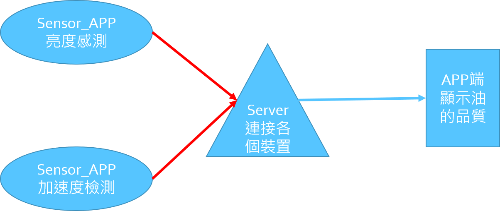

# -Oil-quality-inspection-system

運用手機加速度及光線感測器檢測油質
==

App
--
  App_Client.py為可在pc及手機上執行之結果觀測介面。<\br>
  還境:<\br>
  python 3.7<\br>
  kivy<\br>
  <\br>
  Sensor_Client.py為運用kivy所開發之app，需運用buildozer打包成apk後使用。<\br>
  還境:<\br>
  python 3.7<\br>
  kivy<\br>
  plyer<\br>
  <\br>
  Client.py為網路連線client處理之模組，需與App_Client.py及Sensor_Client.py同時使用。<\br>
  
Server
--
  Server.py為在server上執行之連線server，接收cilent資訊作處理及回應。<\br>
  還境:<\br>
  python 3.7<\br>
  
架構圖
--

